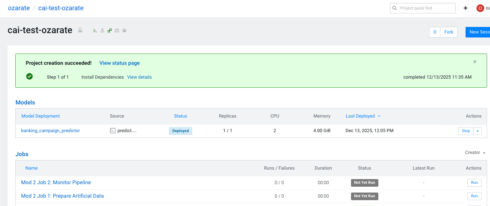
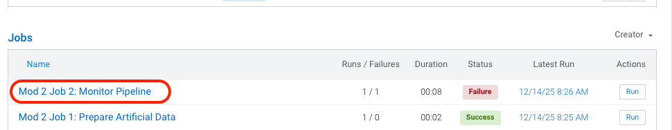
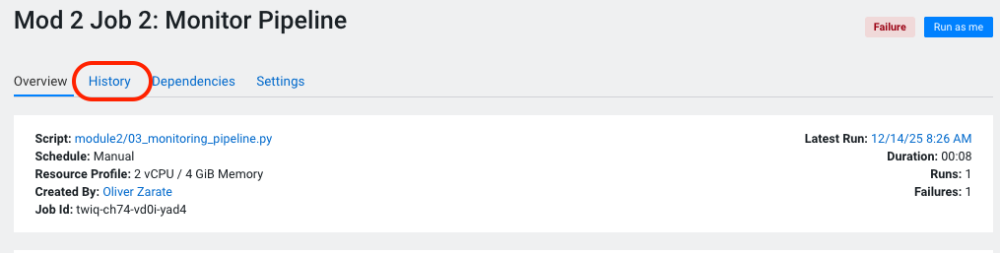

# Module 2: Model Monitoring with Degradation Detection

This module implements a comprehensive model monitoring pipeline that tracks predictions over time and automatically detects when model accuracy degrades.

## What We're Doing in This Module

**The Real-World Problem:**

In production, machine learning models don't stay accurate forever. As data changes over time (concept drift, distribution shift, etc.), model accuracy naturally degrades. Organizations need to monitor model performance and take action—like retraining—when accuracy drops below acceptable levels.

**Our Approach:**

Since we're in a workshop environment and don't have real production data flowing in over months, we're **simulating model degradation** to demonstrate monitoring and alerting workflows. Here's how:

1. **Manufacturing Degradation**: We use `02_prepare_artificial_data.py` to create fake ground truth labels that intentionally force our model's accuracy to degrade over time. This lets us simulate what would naturally happen in production, but in a controlled, accelerated way.

2. **Simulating Time Through Batches**: Each batch of data represents a different time period (e.g., Week 1, Week 2, etc.). By processing these batches sequentially, we simulate the passage of time and can watch accuracy decline period-by-period.

3. **Triggering Alerts**: We set an **accuracy threshold** (e.g., 85%). When the model's accuracy drops below this threshold, our monitoring job detects the degradation and can trigger alerts or actions (like stopping the pipeline, sending notifications, or initiating retraining).

**Key Difference from Module 1:**

- **Module 1**: We created jobs manually through the CML UI
- **Module 2**: We create jobs **programmatically** using scripts, but still trigger/run them through the UI

This demonstrates how to automate infrastructure setup while maintaining manual control over execution.

**Why This Matters:**

This pattern is essential for production ML systems. By detecting degradation early and automatically triggering retraining, you can maintain model quality without manual intervention.

---

## Overview

The monitoring pipeline consists of **2 CML Jobs**:

```
Job 1: 02_prepare_artificial_data.py (One-time setup)
    ↓
Job 2: 03_monitoring_pipeline.py (Integrated Monitoring)
    ├─ Period 0: Get predictions → Load ground truth → Check model
    ├─ Period 1: Get predictions → Load ground truth → Check model
    ├─ Period 2: Get predictions → Load ground truth → Check model
    └─ ... (repeats for each period until degradation or end of data)
```

**Job Execution Pattern**:
- Number of periods = Total data size / Batch size
- With 1000 samples and batch size 250 = 4 periods
- `03_monitoring_pipeline.py` runs **once** and processes **all periods sequentially**
- Single job manages period state internally (no external state files needed)
- Automatically detects degradation and exits gracefully
- All results saved to `data/monitoring_results.json`

## Key Features

- **Self-Contained Pipeline**: Single job manages all periods internally
- **Period-based Processing**: Splits data into multiple time periods for sequential monitoring
- **Batch Predictions**: Processes predictions in configurable batch sizes
- **Cloudera Integration**: Tracks metrics using `cml.track_delayed_metrics()` and `cml.track_aggregate_metrics()`
- **Degradation Detection**: Automatically detects statistically significant accuracy drops
- **Configurable Thresholds**: Adjust accuracy requirements and degradation sensitivity
- **Comprehensive Logging**: Logs to both console and file (`data/monitoring_log.txt`)

---

## Quick Start

### Step 1: Create Jobs Programmatically

Open and run the Jupyter notebook `01_create_jobs.ipynb` to create the monitoring jobs programmatically.

This notebook will create two CML jobs:
- **Mod 2 Job 1: Prepare Artificial Data** - Generates the degraded dataset
- **Mod 2 Job 2: Monitor Pipeline** - Runs the monitoring workflow

**What the notebook does:**
- Creates job definitions using the CML API
- Configures resources (CPU, memory, runtime)
- Sets up the scripts to run

### Step 2: Run Jobs Through the UI

After creating the jobs, navigate to the **Jobs** tab in the CML UI:

**2a. Run Data Preparation Job**



1. Locate and click on **"Mod 2 Job 1: Prepare Artificial Data"**
2. Click **"Run"**
3. Wait for the job to complete successfully ✅
4. This creates:
   - `data/artificial_ground_truth_data.csv` - Full dataset with engineered features, predictions, and artificial labels
   - `data/ground_truth_metadata.json` - Period configuration


**2b. Run Monitoring Pipeline Job**

1. Locate and click on **"Mod 2 Job 2: Monitor Pipeline"**
2. Click **"Run"**
3. **Expected outcome**: The job will run through several periods and then **FAIL** ❌ when accuracy drops below the threshold

This is the expected behavior! The job failure signals that model degradation has been detected.




### Step 3: Inspect Job Logs and Diagnostics

After Job 2 fails, examine the logs to understand what happened:

1. Click on the failed job run (see image above)
2. Review the **History** tab
3. Make sure you are looking at **session** and not logs.
4. Look for messages about:
   - Accuracy metrics per period
   - The specific period where degradation was detected
   - The accuracy drop that triggered the failure



### Step 4: Analyze Model Metrics

Open and run the Jupyter notebook `04_model_metrics_analysis.ipynb` for detailed diagnostics:

**What this notebook shows:**
- Period-by-period accuracy trends
- Visualization of model degradation over time
- Detailed metrics analysis
- Recommendations for next steps (e.g., model retraining)

This notebook helps you understand exactly when and how the model degraded.

## Data Architecture

### Artificial Ground Truth Dataset

The artificial dataset includes:
- **Engineered features** from Module 1 (original features)
- **known_prediction**: Model predictions from Module 1
- **artificial_ground_truth**: Labels that match predictions with degrading accuracy
- **period**: Which time period (0, 1, 2, ...) each sample belongs to
- **Probability scores**: probability_class_0, probability_class_1

**Degradation Pattern** (with 20 periods and 2.5% per-period drop):
- Period 0: 95% accuracy (baseline)
- Period 1: 92.5% accuracy (2.5% drop)
- Period 5: 82.5% accuracy
- Period 10: 72.5% accuracy
- Period 15: 62.5% accuracy
- Period 19: 52.5% accuracy (reaches ~50% by end)

## Scripts

### 02_prepare_artificial_data.py

**Status**: One-time setup (run manually)

**Purpose**: Creates the artificial ground truth dataset with intentional accuracy degradation

**What it does**:
1. Reads BATCH_SIZE from top of script (hardcoded)
2. Loads engineered inference data from Module 1
3. Loads predictions from Module 1
4. Calculates num_periods = actual_total_samples / BATCH_SIZE
5. Calculates degradation_rate to spread degradation evenly across all periods
6. Creates artificial ground truth labels with progressive corruption
7. Saves `artificial_ground_truth_data.csv` and `ground_truth_metadata.json`

**Configuration** (hardcoded at top of script):
```python
BATCH_SIZE = 250  # Adjust based on how many periods you want
```

The script will automatically:
1. Load actual data from module1
2. Calculate `num_periods = actual_total_samples / BATCH_SIZE`
3. Determine degradation rate based on number of periods

**Output**:
- `data/artificial_ground_truth_data.csv` (full dataset with labels)
- `data/ground_truth_metadata.json` (period boundaries)

**Run**:
```bash
python module2/02_prepare_artificial_data.py
```

---

### 03_monitoring_pipeline.py

**Status**: CML Job (single integrated pipeline)

**Purpose**: Self-contained monitoring pipeline that processes all periods sequentially in one execution

**What it does**:
1. **Phase 0 - Setup**: Initialize CML client, load metadata, load full dataset
2. **Loop through all periods** (Period 0 to Period N):
   - **Phase 1 - Get Predictions**:
     - Extract period data
     - Process predictions in batches
     - Track metrics via `cml.track_delayed_metrics()`
     - Save predictions to JSON
   - **Phase 2 - Load Ground Truth**:
     - Extract period labels
     - Save labels to JSON
   - **Phase 3 - Check Model**:
     - Calculate accuracy metrics (accuracy, precision, recall, F1)
     - Compare to previous period (degradation detection)
     - Check if accuracy below threshold
     - Track metrics via `cml.track_aggregate_metrics()`
     - **Decision**:
       - **If degraded**: Save results and exit gracefully (job completes with status 0)
       - **If last period**: Save results and exit successfully
       - **Otherwise**: Continue to next period

**Environment Variables** (optional, all have defaults):
- `BATCH_SIZE`: Samples per batch (default: 250)
- `MODEL_NAME`: Deployed model name (default: "banking_campaign_predictor")
- `PROJECT_NAME`: CML project name (default: "CAI Baseline MLOPS")
- `ACCURACY_THRESHOLD`: Minimum acceptable accuracy (default: 0.85 = 85%)
- `DEGRADATION_THRESHOLD`: Max drop before alert (default: 0.05 = 5%)

**Command-line Arguments**:
```bash
# Run all periods (default 0 to total)
python 03_monitoring_pipeline.py

# Run specific period range
python 03_monitoring_pipeline.py --start-period 0 --end-period 3

# Run single period
python 03_monitoring_pipeline.py --start-period 2 --end-period 2
```

**Input**:
- `data/artificial_ground_truth_data.csv` (full dataset)
- `data/ground_truth_metadata.json` (period configuration)

**Output**:
- `data/predictions_period_{PERIOD}.json` (predictions per period)
- `data/period_{PERIOD}_ground_truth.json` (labels per period)
- `data/monitoring_results.json` (final summary with status)
- `data/monitoring_log.txt` (detailed execution log)

**Key Advantages**:
- ✅ **Single job** - No job chaining or dependencies
- ✅ **Self-contained** - All period state managed internally
- ✅ **Graceful degradation** - Exits with status 0 even when degradation detected
- ✅ **Comprehensive logging** - All events logged to console and file
- ✅ **Flexible execution** - Can run specific period ranges via command-line args

---

## Setup Instructions

### Step 1: Generate Artificial Data

```bash
cd /home/cdsw/module2
python 02_prepare_artificial_data.py
```

Expected output:
- `data/artificial_ground_truth_data.csv` created
- `data/ground_truth_metadata.json` created
- Summary showing periods created with degradation

### Step 2: Verify Data Files

```bash
ls -l /home/cdsw/module2/data/
```

You should see:
- `artificial_ground_truth_data.csv`
- `ground_truth_metadata.json`

### Step 3: Create CML Job

Use the CML UI or API to create one job:

**Job: Monitor Pipeline**
```yaml
Name: Mod 2 Job: Monitor Pipeline
Script: module2/03_monitoring_pipeline.py
Runtime: Python 3.10 (2024.10+)
CPU: 2 cores
Memory: 4 GB
Environment: (optional - uses defaults)
  BATCH_SIZE: 250
  ACCURACY_THRESHOLD: 0.85
  DEGRADATION_THRESHOLD: 0.05
Trigger: Manual (UI or API)
```

### Step 4: Run the Job

```bash
# Via CML UI:
# 1. Go to Jobs tab
# 2. Click on "Monitor Pipeline"
# 3. Click "Run Now"
# 4. Wait for completion
```

The job will process all periods and exit automatically when:
- Degradation is detected, OR
- All periods have been processed

---

## Monitoring Accuracy Over Time

The pipeline tracks accuracy degradation across periods:

**Expected Results** (with 20 periods, 2.5% drop per period, 85% threshold):
- Period 0: ~95% accuracy ✓ PASS
- Period 1-3: ~92-87% accuracy ✓ PASS (gradual decline)
- Period 4: ~85% accuracy ✓ PASS (at threshold)
- Period 5+: <85% accuracy → Pipeline may exit based on degradation logic
- Period 19: ~52% accuracy (final period, if reached)

**Real-world Interpretation**:
- First few periods: Model performs well
- Later periods: Model accuracy degrades as data distribution changes
- Alert triggers: When accuracy drop exceeds threshold
- Pipeline stops: When degradation detected or final period reached

---

## Customization

### Number of Periods

The number of periods is calculated automatically based on BATCH_SIZE:
```python
num_periods = total_samples / batch_size
# Example: 1000 samples / 50 batch = 20 periods
```

To change it, edit `02_prepare_artificial_data.py` and adjust `BATCH_SIZE`:
```python
BATCH_SIZE = 100  # Smaller batch = more periods
```

**Important**: Changing BATCH_SIZE affects how many periods will be created.

### Adjust Degradation Rate

Edit `02_prepare_artificial_data.py`:
```python
degradation_rate = 0.05  # 5% drop per period
```

### Adjust Accuracy Thresholds

Set environment variables in the CML job:
```
ACCURACY_THRESHOLD=0.85        # Exit if below 85%
DEGRADATION_THRESHOLD=0.05     # Exit if drops > 5%
```

### Adjust Batch Size

Set environment variable in the CML job:
```
BATCH_SIZE=100  # Process 100 samples per batch
```

---

## Architecture Notes

### Single Job vs. Multiple Jobs

The original design used **separate jobs**:
- Job 1: Get Predictions (triggered per period)
- Job 2: Load Ground Truth (triggered per period)
- Job 3: Check Model (triggered per period)

The current design consolidates to **1 integrated job**:
- Job 1: Monitor Pipeline (processes all periods in one execution)

**Why this is better:**
1. ✅ **Simpler**: Single job manages all periods
2. ✅ **Reliable**: No job chaining failures or state passing issues
3. ✅ **Faster**: No overhead from starting multiple jobs
4. ✅ **Cleaner logs**: All output in one execution
5. ✅ **Self-contained**: No external state file dependencies

### API Patterns Used

The scripts follow Cloudera ML API patterns:

**CML Integration**:
- `cml.track_delayed_metrics()` for individual prediction tracking
- `cml.track_aggregate_metrics()` for period-level metrics
- Model deployment CRN retrieval

**Internal State Management**:
- Period tracking via loop counter (no external files)
- Results saved to JSON for inspection
- Comprehensive logging to console and file

---

## Files Generated During Execution

```
data/
├── artificial_ground_truth_data.csv      # Created by Job 1: Data + labels
├── ground_truth_metadata.json            # Created by Job 1: Period config
├── predictions_period_0.json             # Created by Job 2: Predictions
├── predictions_period_1.json
├── predictions_period_2.json
├── period_0_ground_truth.json            # Created by Job 2: Labels per period
├── period_1_ground_truth.json
├── period_2_ground_truth.json
├── monitoring_results.json               # Created by Job 2: Final summary
└── monitoring_log.txt                    # Created by Job 2: Execution log
```

---

## Troubleshooting

### Missing Artificial Data

**Error**: `FileNotFoundError: Groundtruth data not found`

**Solution**: Run `02_prepare_artificial_data.py` first

```bash
python module2/02_prepare_artificial_data.py
```

### CML Job Fails to Start

**Error**: Job doesn't run or exits immediately

**Cause**: Missing dependencies or environment issues

**Solution**:
1. Verify Python 3.10+ runtime is available
2. Check that Module 1 data files exist: `module1/inference_data/engineered_inference_data.csv`
3. Verify `data/` directory can be created
4. Check job logs for detailed error messages

### Data Files Not Found

**Error**: `FileNotFoundError: module1/inference_data/engineered_inference_data.csv`

**Solution**:
1. Ensure Module 1 is completed and data files exist
2. Run from project root: `cd /home/cdsw`
3. Verify file paths are correct

### BATCH_SIZE Mismatch

**Issue**: Periods calculated incorrectly or data missing

**Cause**: BATCH_SIZE changed but data not regenerated

**Solution**:
1. Update BATCH_SIZE in `02_prepare_artificial_data.py`
2. Delete old data files: `rm data/artificial_ground_truth_data.csv data/ground_truth_metadata.json`
3. Regenerate data: `python 02_prepare_artificial_data.py`

---

## Integration with Module 1

Module 2 uses data generated by Module 1:

```
Module 1 Output:
├── engineered_inference_data.csv    → Used by 02_prepare_artificial_data.py
└── predictions.csv                 → Used by 02_prepare_artificial_data.py

Module 2 Creates:
└── Artificial labels based on Module 1 predictions
    └── Simulates model degradation for monitoring demo
```

---

## Next Steps

Once monitoring is working:

1. **Real Deployment**: Replace artificial data with real predictions
2. **Live Models**: Integrate with actual deployed model endpoints
3. **Real Ground Truth**: Load actual labels as they become available
4. **Alerting**: Add email/Slack notifications when degradation detected
5. **Retraining**: Trigger model retraining when degradation detected

---

## Questions?

Refer to the inline documentation in each script for detailed implementation notes.
