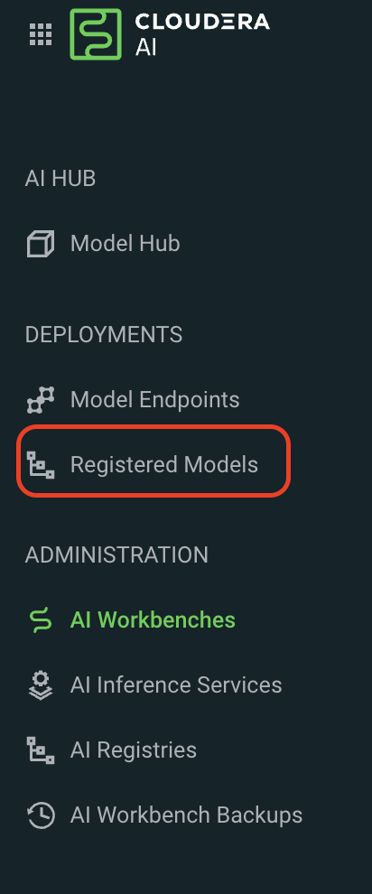
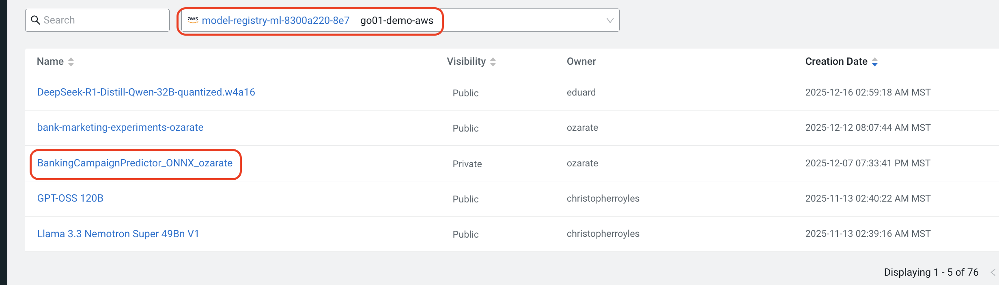
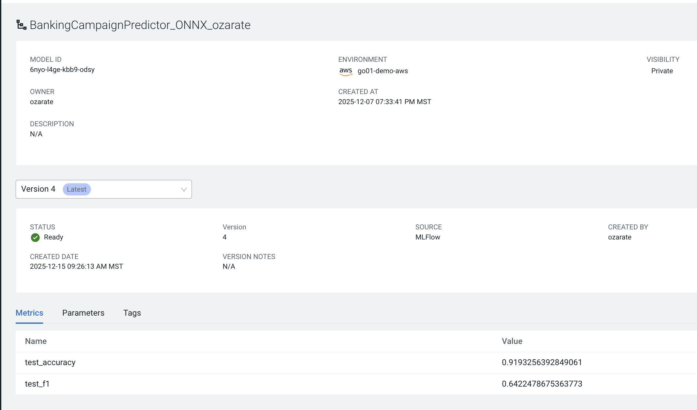
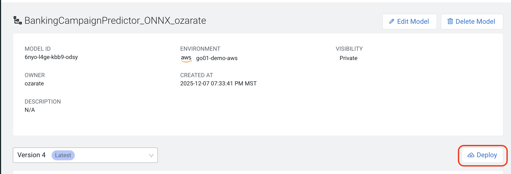
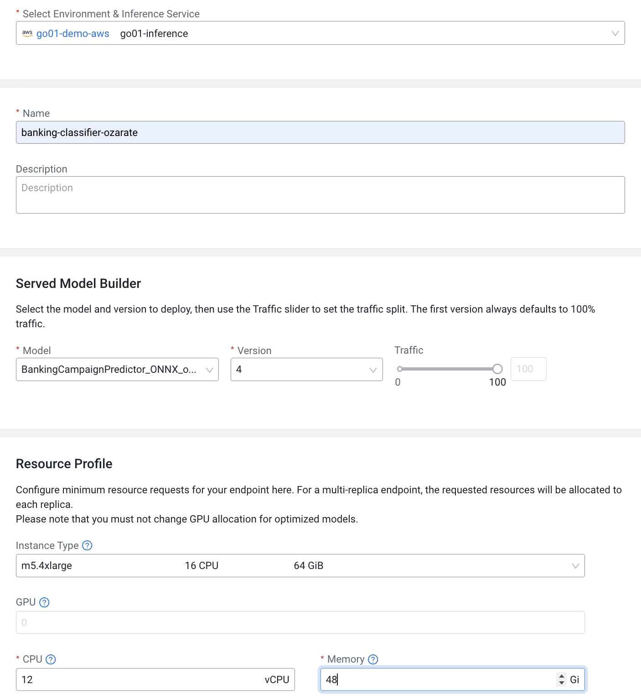

# Module 4: Production Deployment with AI Inference Service

## Overview

In Module 4, you'll deploy your retrained ONNX model to Cloudera AI Inference Service and compare its performance against the CML Model endpoint from Module 1. This demonstrates the complete evolution from development to production deployment.

### What You'll Accomplish

- Convert sklearn model to ONNX format for optimized inference
- Register the model in MLflow Model Registry
- Deploy to Cloudera AI Inference Service via UI
- Compare CML Models (development) vs AI Inference Service (production)
- Measure performance improvements in latency and throughput

---

## Step 1: Create and Register ONNX Model

### Run the Model Creation Script

Navigate to the module4 folder and execute:

```bash
cd module4
python 01_create_onnx_model.py
```

### What This Script Does

- **Loads Data**: Original bank marketing data plus newly labeled customer data
- **Trains Model**: Combines datasets and trains a fresh RandomForest model with improved performance
- **Converts to ONNX**: Converts the sklearn model to ONNX format for optimized inference serving
- **Registers Model**: Registers the ONNX model in MLflow's Model Registry with proper versioning and metadata
- **Outputs Metrics**: Creates JSON file with performance metrics (F1 score, accuracy) and MLflow registration details

**✅ Verify the script completes successfully before proceeding.**

---

## Step 2: Deploy Model via UI (Cloudera AI Inference Service)

### 2.1 Navigate to Cloudera AI

Go to the main CDP (Cloudera Data Platform) page.


### 2.2 Access Machine Learning Workspace

From the CDP menu, select **Machine Learning**.



### 2.3 View Registered Models

In the Cloudera AI interface:
1. Navigate to **DEPLOYMENTS** → **Registered Models**
2. Select the appropriate model registry
3. Look for your model - it will be identified with your username
   - Model name format: `BankingCampaignPredictor_ONNX_<username>`




**[Add screenshot: Registered Models list with model highlighted]**

### 2.4 View Model Details

Click on your model to see important information:
- Model ID
- Metrics (F1 score, accuracy)
- Parameters
- Model version
- Created date and source



### 2.5 Deploy the Model

1. Click the **Deploy** button in the top right
2. A dialog will appear: **Deploy Model**
3. Select your environment and inference service:
   - Environment: `go01-demo-aws` (or your assigned environment)
   - Inference Service: `go01-inference` (or your assigned service)
4. Click **Deploy**




### 2.6 Configure Deployment Settings

Fill in the deployment configuration:

**Served Model Builder:**
- **Model**: BankingCampaignPredictor_ONNX_<username>
- **Version**: 1 (or latest)
- **Traffic**: 100 (full traffic to this version)

**Resource Profile:**
- **Name**: `banking-classifier-<username>`
- **Instance Type**: m5.4xlarge (16 CPU, 64 GiB) or custom
- **CPU**: 12 vCPUs
- **Memory**: 48 GiB
- **Endpoint Autoscale Range**:
  - Minimum: 1
  - Maximum: 3



Click **Deploy** to start the deployment.

### 2.7 Monitor Deployment

The deployment will take a few minutes. You can monitor the status:
- **Deploying**: Model is being deployed
- **Running**: Model is ready for inference

Once deployed, note down:
- **Endpoint URL**: You'll need this for the comparison notebook
- **Model ID**: Used for making predictions

---

## Step 3: Compare Endpoints Performance

### Run the Comparison Notebook

Open and run `module4_compare_endpoints.ipynb`:

```bash
# In your CML workbench, open:
02_compare_endpoints.ipynb
```

### Run All Cells

Execute all cells in the notebook to:
- Load and prepare test data in two formats (CML and ONNX)
- Test CML Model endpoint (single predictions and batch)
- Test AI Inference Service endpoint (single predictions and batch)
- Compare performance metrics side-by-side

---

## Expected Results

### Performance Comparison

You should see measurable improvements with AI Inference Service:

| Metric | CML Models | AI Inference Service | Improvement |
|--------|-----------|---------------------|-------------|
| Avg Latency | ~170 ms | ~50 ms | ~70% faster |
| Throughput | ~6 pred/sec | ~20 pred/sec | ~3x higher |
| P95 Latency | ~180 ms | ~60 ms | ~67% faster |

**Note:** Actual numbers will vary based on your environment and configuration.

### Key Differences

| Feature | CML Models | AI Inference Service |
|---------|-----------|---------------------|
| **Purpose** | Development/Testing | Production Serving |
| **Authentication** | API Key | JWT Token (enterprise) |
| **API Protocol** | Custom REST | Open Inference Protocol |
| **Model Format** | Pickled sklearn | ONNX (optimized) |
| **Scale** | Small-Medium | Enterprise Scale |
| **Availability** | Basic | HA + Autoscaling |
| **Monitoring** | Basic metrics | Full observability |

---

## Key Takeaways for Customer Conversations

### 1. Performance Story
- AI Inference Service delivers measurable latency improvements
- ONNX optimization + Triton runtime = faster inference
- Concrete numbers to show: "~70% faster response times"

### 2. Enterprise Readiness
- **Security**: API keys → JWT tokens (enterprise authentication)
- **Standards**: Custom API → Open Inference Protocol (no vendor lock-in)
- **Operations**: Basic monitoring → Full observability stack

### 3. Scale & Availability
- **CML Models**: Good for dev/test, limited production scale
- **AI Inference Service**: Built for production with autoscaling and HA
- **Cost Efficiency**: Scale-to-zero when idle, scale-up under load

### 4. The Evolution Path

This is the natural MLOps progression:
1. ✅ Start with CML Models for development (Module 1)
2. ✅ Monitor performance and detect issues (Module 2)
3. ✅ Optimize and convert to ONNX (Module 3)
4. ✅ Deploy to AI Inference Service for production (Module 4)

---

## Troubleshooting

### Common Issues

**Issue**: Model not appearing in Registered Models
- **Solution**: Verify the `create_onnx_model.py` script completed successfully. Check the output JSON file for MLflow registration details.

**Issue**: Deployment fails or stays in "Deploying" state
- **Solution**: Check resource availability in your environment. Verify CPU/memory settings don't exceed quota.

**Issue**: 400 errors when testing AI Inference Service
- **Solution**: Ensure you're using the correct 20 features with underscores (not dots). The notebook has been updated to handle this correctly.

**Issue**: JWT token not found at /tmp/jwt
- **Solution**: The token should be automatically available in CML workbench sessions. If missing, check your CDP authentication.

---

## Next Steps

- Explore the monitoring dashboards in Cloudera AI
- Test autoscaling behavior under load
- Try deploying your own models
- Build customer demos with your specific use cases

---

## Files in This Module

- `create_onnx_model.py` - Creates and registers ONNX model
- `module4_compare_endpoints.ipynb` - Performance comparison notebook
- `Module 4 ui steps.pdf` - Detailed UI deployment guide with screenshots
- `README.md` - This file

---

**🎉 Congratulations on completing the full MLOps lifecycle workshop!**
